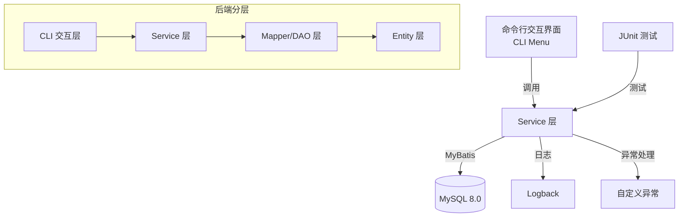
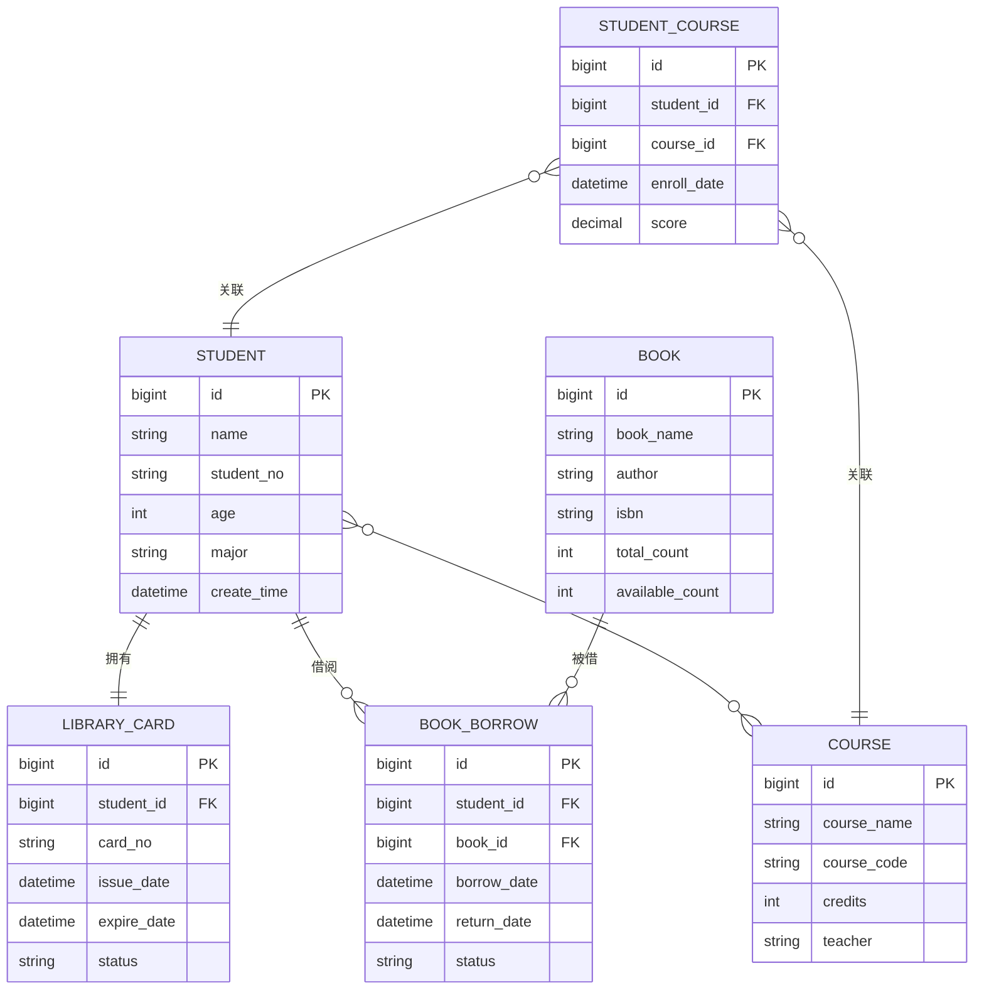

# 图书管理系统 - 项目设计文档

## 1. 系统架构



## 2. 数据库设计（ER 图）



### 2.1 学生-图书关系说明（一对多 vs 中间表）

**语义上的关系**：从学生视角为「一对多」（1 学生 : N 本所借图书）。

**实现方式**：通过 `book_borrow` 中间表，而非 `book.student_id` 直连。

| 方案 | 优点 | 缺点 |
|------|------|------|
| **当前：book_borrow 中间表** | 记录借阅历史、归还日期、状态；支持多人借同一本书（不同时间） | 需 JOIN 查询 |
| **替代：book 表加 student_id** | 查询简单 | 无法保留历史记录；难以表达多副本、多次借阅 |

**结论**：图书馆业务需借阅流水（borrow_date、return_date、status），必须使用中间表。`Student.borrowedBooks` 是逻辑上的 1:N，实现上通过 `book_borrow` 关联得到。

## 3. 核心功能模块

### StudentService（学生管理）
- `addStudent()` - 新增学生
- `updateStudent()` - 更新学生信息
- `deleteStudent()` - 删除学生（级联删除借书证、借阅记录、选课记录）
- `getStudentById()` - 查询学生详情（含借书证、借阅记录、选修课）
- `listStudents()` - 分页查询学生列表
- `searchStudents()` - 条件检索（姓名、学号、专业）

### LibraryCardService（借书证管理）
- `issueCard()` - 为学生办理借书证（1:1 级联）
- `getCardByStudentId()` - 根据学生 ID 查询借书证
- `renewCard()` - 续期借书证
- `listCards()` - 分页查询借书证列表

### BookService（图书管理）
- `addBook()` - 新增图书
- `updateBook()` - 更新图书信息
- `deleteBook()` - 删除图书
- `listBooks()` - 分页查询图书列表
- `searchBooks()` - 条件检索（书名、作者、ISBN）

### BookBorrowService（借阅管理）
- `borrowBook()` - 借书（1:N 级联）
- `returnBook()` - 还书
- `getBorrowsByStudentId()` - 查询学生借阅记录
- `listBorrows()` - 分页查询借阅记录

### CourseService（课程管理）
- `addCourse()` - 新增课程
- `updateCourse()` - 更新课程信息
- `deleteCourse()` - 删除课程
- `listCourses()` - 分页查询课程列表
- `getCourseEnrollmentsByStudentId()` - 查询学生选课记录（含课程及成绩）
- `getCourseWithStudents()` - 查询课程及选修学生（M:N 级联）

### StudentCourseService（选课管理）
- `enrollCourse()` - 学生选课（M:N 级联）
- `dropCourse()` - 学生退课
- `updateScore()` - 更新成绩

## 4. 命令行交互界面

### 主菜单
```
========================================
    图书管理系统 v1.0
========================================
1. 学生管理
2. 借书证管理
3. 图书管理
4. 借阅管理
5. 课程管理
6. 选课管理
7. 综合查询（级联查询）
0. 退出系统
========================================
请选择功能模块：
```

### 子菜单示例（学生管理）
```
========================================
    学生管理
========================================
1. 新增学生
2. 修改学生信息
3. 删除学生
4. 查询学生详情（含级联信息）
5. 学生列表（分页）
6. 条件检索
0. 返回主菜单
========================================
```

### 交互规范
- 所有输入必须有格式验证
- 操作成功/失败有明确提示
- 分页查询支持上一页/下一页/跳转
- 删除操作需要二次确认

## 5. 技术栈

### 后端
- Java 17
- MyBatis 3.5.13（纯 MyBatis，无 Spring Boot，无 MyBatis-Plus）
- MySQL 8.0
- SLF4J 2.0.9 + Logback 1.4.11
- ValidationUtil（自定义输入校验）
- JUnit 5.10.0

### 部署
- Docker
- Docker Compose
- MySQL 8.0 (跨平台镜像)

## 6. 测试覆盖

### 单元测试（JUnit 5）
- 学生 CRUD 测试
- 借书证 1:1 级联测试
- 图书借阅 1:N 级联测试
- 选课 M:N 级联测试
- 分页查询测试
- 条件检索测试
- 级联删除测试
